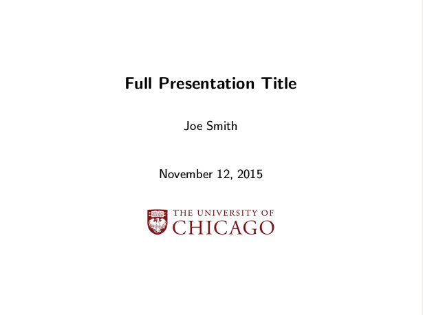
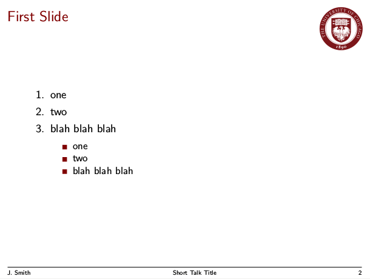
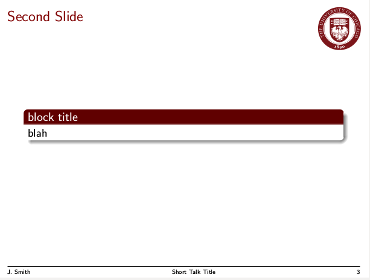

beamer theme for UChicago-themed presentation slides
====================================================

A custom LaTeX beamer theme is defined for University of Chicago-themed
presentation slides. The focus is simplicity;
the footer navigation symbols in standard beamer are suppressed.
The general
color theme is, not surprisingly, based on the iconic UChicago maroon.

Use
---

To use this beamer theme, simply use the beamer class as usual and
call the `UChicago` theme in the preamble of your `.tex` file:

~~~ latex
\documentclass{beamer}
\usetheme{UChicago}
~~~

The theme depends on packages `graphicx` and `textpos`.

Please be sure that `beamerthemeUChicago.sty`, `uchicago.eps`, and
`ucseal.eps`
are in the same directory as your LaTeX document.

Sample
------

For a working example, please see `sample-doc.tex` and `sample-doc.pdf`
included in this repository. Screenshots:

Repository
----------

This `UChicago` LaTeX beamer theme is hosted at https://github.com/JacksonLLee/uchicago-beamer

Copyright
---------

Copyright 2015 Jackson Lee

Licensed under the Apache License, Version 2.0 (the "License");
you may not use this file except in compliance with the License.
You may obtain a copy of the License at

 http://www.apache.org/licenses/LICENSE-2.0

Unless required by applicable law or agreed to in writing, software
distributed under the License is distributed on an "AS IS" BASIS,
WITHOUT WARRANTIES OR CONDITIONS OF ANY KIND, either express or implied.
See the License for the specific language governing permissions and
limitations under the License.

